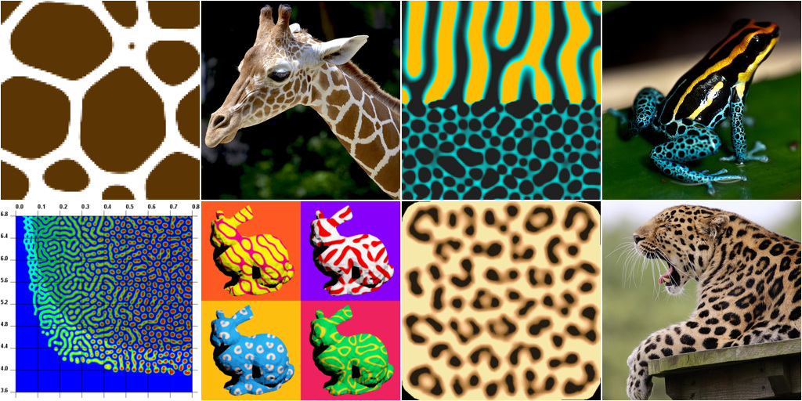

# pattern-explorer

Reference implementation and experiments for the model described on the paper _Pattern formation through minimalist biologically inspired cellular simulation_, presented at the Graphics Interface 2017 conference.

The full paper, supplementary material and respective experiment files are in the [paper](https://github.com/mgmalheiros/pattern-explorer/tree/master/paper) folder.

## Download

The source code can be compiled on Linux and Windows, and should be fairly simple to port to other platforms.

A [precompiled binary](https://github.com/mgmalheiros/pattern-explorer/releases) is also available for Windows, in 32 and 64-bit versions, being able to run on Windows 7 and later.

## Usage

Key bindings for the **pattern** program:

  * **space** - run a single iteration
  * **tab** - run at most 50 iterations
  * **esc** - quit
  * **a** - change shown chemical
  * **b** - show/hide information bar
  * **c** - center pattern in view
  * **d** - show/hide domain limits
  * **i** - show/hide mirror pairs (defined in shape files)
  * **l** - reload colormap definitions
  * **m** - change colormap type
  * **n** - show/hide nearest neighbors for current cell (picked by left-click)
  * **o** - output a screenshot
  * **p** - show/hide polarity vectors
  * **r** - reload experiment file
  * **s** - start/stop simulation
  * **t** - output high-quality interpolated texture
  * **x** - change cell exhibition type (octogon, square, inscribed hexagon, circumscribed hexagon and circle)

## Compiling

There is a simple Makefile, which needs to be updated before compiling. Visual Studio project files are in the **misc** folder.

There are three executables available:

  * **pattern**: GUI program, with all features
  * **offline**: command-line only version, made for benchmarking purposes
  * **simple**: simple example of defining the initial state and running the simulation through the API (does not parse experiment files)

Required dependencies:

  * [AntTweakBar](http://anttweakbar.sourceforge.net/), for the user interface
  * [GLM](http://glm.g-truc.net/), for utility mathematical functions
  * [GLUT](http://freeglut.sourceforge.net/), as simple platform-independent windowing system for OpenGL

Optional dependencies (must be explicitly enabled in the Makefile):

  * [LibPNG](http://www.libpng.org/), for screenshot support
  * [CGAL](http://www.cgal.org/), for the natural neighbor coordinate computation, which produces high-quality output textures (needs also LibPNG)
